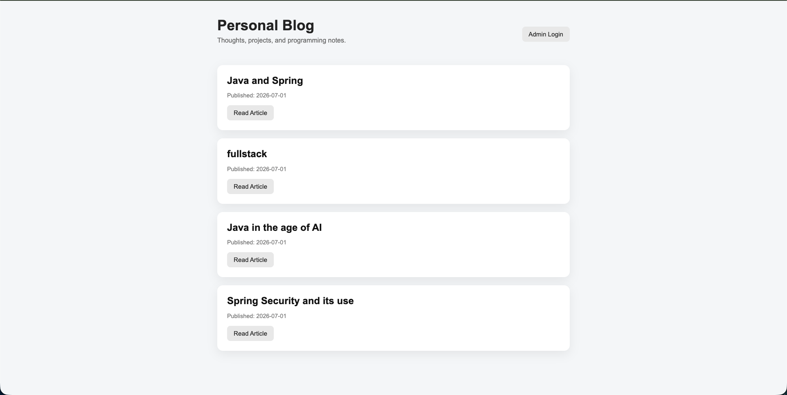
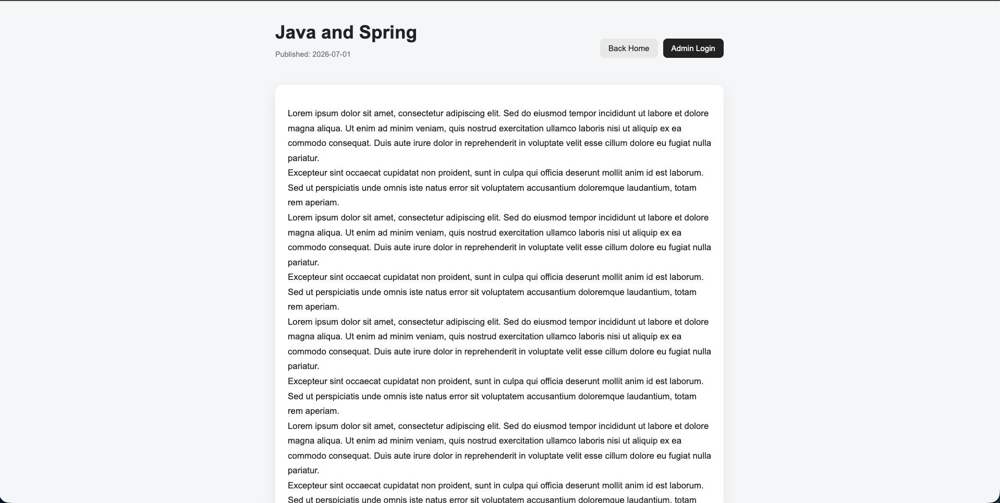
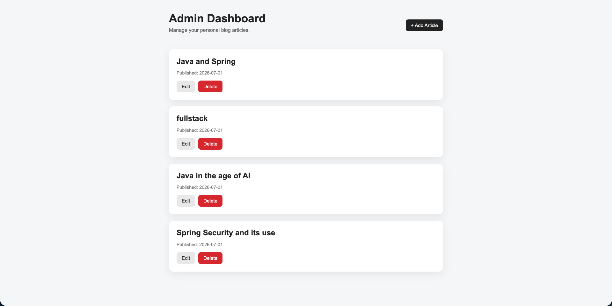
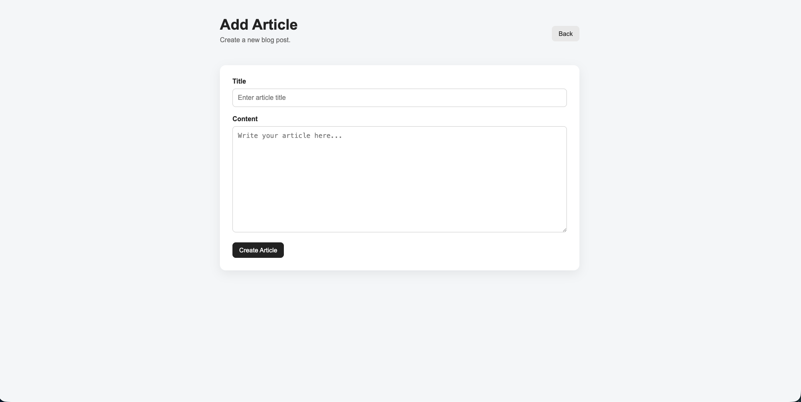
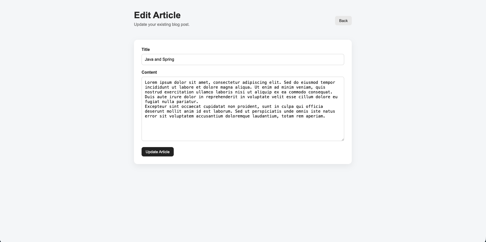

# Personal Blog Application

A personal blog web application built with Java, Spring Boot, Thymeleaf, Spring Security, and JSON file storage.

Guests can view blog articles, while an authenticated admin can create, edit, and delete articles.

---

## Features

- View published blog articles
- Read individual articles
- Admin dashboard for managing articles
- Create, edit, and delete articles
- Store articles as JSON files
- Protect admin routes with HTTP Basic Authentication

---

## Tech Stack

- Java
- Spring Boot
- Thymeleaf
- Spring Security
- Maven
- HTML/CSS
- JSON file storage

---

## Screenshots

### Guest Pages

#### Home Page



#### Article Page



---

### Admin Pages

#### Admin Dashboard



#### Add Article Page



#### Edit Article Page



---

## Authentication

Admin pages are protected with HTTP Basic Authentication.

```text
Username: admin
Password: password
```

---

## How to Run

Clone the repository:

```bash
git clone <your-repository-url>
```

Navigate into the project folder:

```bash
cd personal-blog
```

Run the application:

```bash
./mvnw spring-boot:run
```

Open in browser:

```text
http://localhost:8080
```

---

## Project Structure

```text
personal-blog/
├── images/
├── data/
├── src/
├── pom.xml
└── README.md
```

---

## What I Learned

This project helped me practice Spring MVC, Thymeleaf templates, CRUD operations, JSON file persistence, and basic route protection with Spring Security.